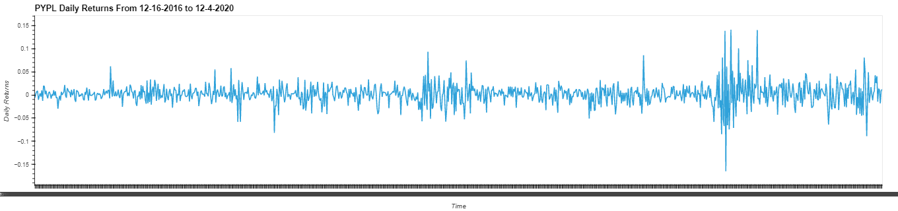
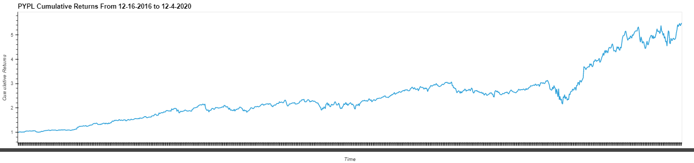
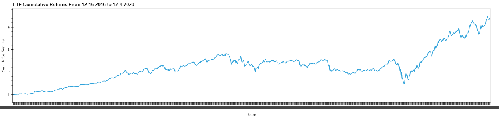

# *ETF Analyzer*
---
In this study we will analyze data from a database consisting of four different ETFs.  An ETF is an exchange-traded fund and is a popular 
investment vehicle because these funds contain many different stocks and therefore offer more diversification.  Investing in ETFs, also
called passive investing, allows the investor less risk due to the diversification of assets.  We will investigate the daily returns, the
average daily returns, and the cumulative returns of a fintech ETF that consists of four stocks: GOST, GS, PYPL, and SQ. 

Using the jupyter notebook, we will utilize SQL, Python and Voila library to analyze the performance of the ETF.  We will also include 
interactive visualizations.  

---
## Technologies:

Install Voila in your environment.

```python
  pip install voila
```

The Jupyter file utilizes python 3.7 along with the following libraries:

numpy

pandas

hvplot.pandas

sqlalchemy

```python
  pip install jupyterlab
  pip install numpy
  pip install pandas
  pip install hvplot  
  pip install sqlalchemy
```

## Usage:

Use the Voila library to deploy the notebook as a web application:
In your terminal, navigate to the cloned file on your local machine and run voila:

```python
  voila etf_analyzer.ipynb
```
Screenshots from Voila:


Along with data analysis researching daily returns, average daily returns, and cumulative returns, .






## Data:

The etf.db file is a database of each stock and their own tables.
Historical data of each stock ranging from 12-16-2016 to 12-04-2020 is recorded in this database.

---

## Contributors

kevin-mau

---

## License

MIT